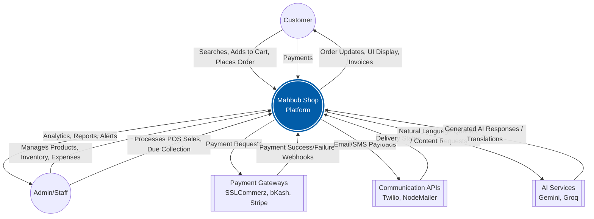
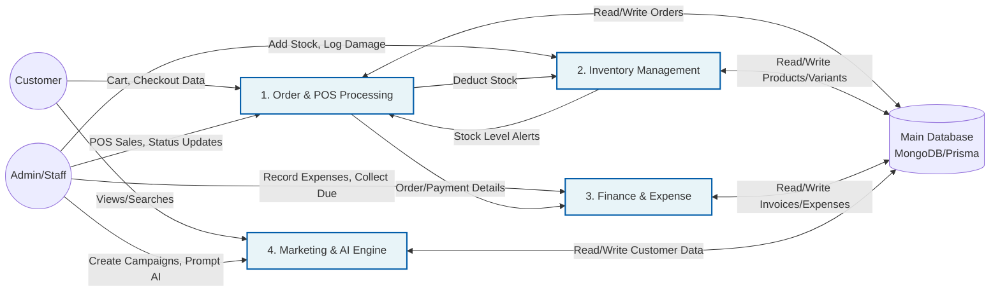
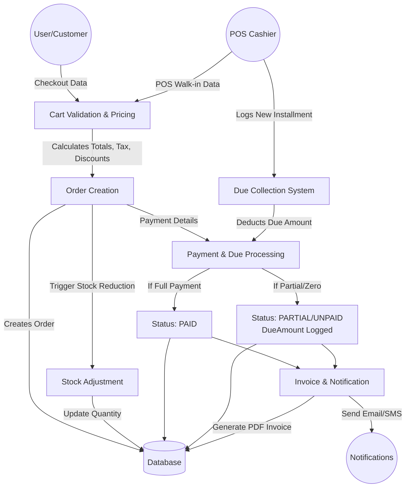
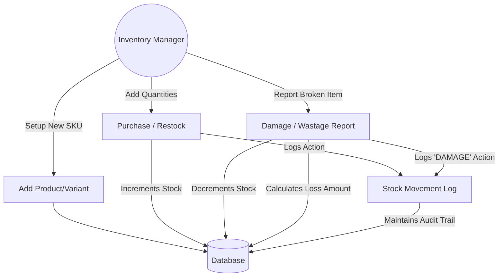

# Mahbub Shop - Data Flow Diagrams (DFD)

This document visualizes the data flow within the Mahbub Shop ecosystem, mapping how data moves between users, internal processes, databases, and external APIs.

---

## 1. Level 0: Context Diagram

This diagram shows the highest-level view of the system, illustrating how external entities interact with the core Mahbub Shop system.

---

## 2. Level 1: Core System Processes

This diagram breaks down the main system into its primary sub-systems/processes: Order Management, Inventory, Financials, and Marketing/AI.

---

## 3. Level 2: Order & Due Collection Flow (Detailed)

This diagram focuses specifically on how an order travels through the system from Checkout/POS to Final Completion, including partial payments (Due).

---

## 4. Level 2: Inventory & Wastage Flow (Detailed)

This shows how inventory levels are manipulated via incoming stock or damages.

