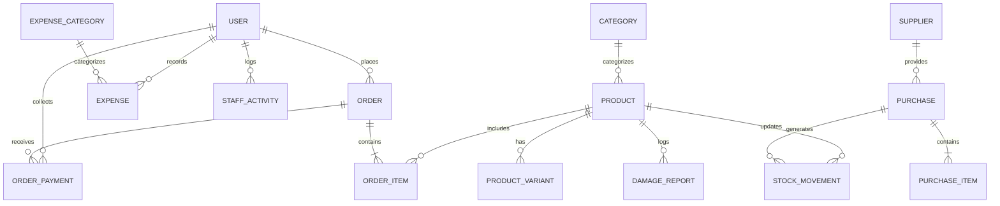

# Mahbub Shop - Detailed Schema Architecture

This document provides a highly detailed, technical breakdown of the database schema, including field types, validations (isRequired, defaults), and relational mappings based on the DFD.

---

## Core Entity-Relationship Diagram (ERD)
The following diagram illustrates the core relationships between the primary domains (Users, Products, Orders, Inventory, and Expenses):

---
## Model: `User`

| Field Name | Type | Required | Default / Validation | Relations |
|---|---|---|---|---|
| **id** | `String` | ✅ Yes | auto(, Primary Key | - |
| **avatar** | `String` | ❌ No | - | - |
| **firstName** | `String` | ✅ Yes | - | - |
| **lastName** | `String` | ✅ Yes | - | - |
| **email** | `String` | ✅ Yes | Unique | - |
| **username** | `String` | ✅ Yes | Unique | - |
| **password** | `String` | ✅ Yes | - | - |
| **role** | `UserRole` | ✅ Yes | CUSTOMER | - |
| **isActive** | `Boolean` | ✅ Yes | true | - |
| **status** | `UserStatus` | ✅ Yes | ACTIVE | - |
| **permissions** | `String[]` | ❌ No | - | - |
| **customRoleId** | `String` | ❌ No | - | - |
| **customRole** | `CustomRole` | ❌ No | - | fields: [customRoleId], references: [id] |
| **groupId** | `String` | ❌ No | - | - |
| **group** | `CustomerGroup` | ❌ No | - | "CustomerGroupUsers", fields: [groupId], references: [id] |
| **invitationToken** | `String` | ❌ No | - | - |
| **invitationSentAt** | `DateTime` | ❌ No | - | - |
| **invitationExpiry** | `DateTime` | ❌ No | - | - |
| **passwordResetToken** | `String` | ❌ No | - | - |
| **passwordResetExpires** | `DateTime` | ❌ No | - | - |
| **isEmailVerified** | `Boolean` | ✅ Yes | false | - |
| **emailVerifiedAt** | `DateTime` | ❌ No | - | - |
| **emailVerificationToken** | `String` | ❌ No | - | - |
| **emailVerificationTokenExpiry** | `DateTime` | ❌ No | - | - |
| **phone** | `String` | ❌ No | - | - |
| **address** | `String` | ❌ No | - | - |
| **website** | `String` | ❌ No | - | - |
| **bio** | `String` | ❌ No | - | - |
| **dob** | `DateTime` | ❌ No | - | - |
| **refreshToken** | `String` | ❌ No | - | - |
| **refreshTokenExpires** | `DateTime` | ❌ No | - | - |
| **createdAt** | `DateTime` | ✅ Yes | now( | - |
| **updatedAt** | `DateTime` | ✅ Yes | - | - |
| **createdBy** | `String` | ❌ No | - | - |
| **createdByUser** | `User` | ❌ No | - | "CreatedUsers", fields: [createdBy], references: [id], onDelete: NoAction, onUpdate: NoAction |
| **createdUsers** | `User[]` | ❌ No | - | "CreatedUsers" |
| **addresses** | `Address[]` | ❌ No | - | - |
| **orders** | `Order[]` | ❌ No | - | - |
| **reviews** | `Review[]` | ❌ No | - | - |
| **wishlist** | `Wishlist[]` | ❌ No | - | - |
| **carts** | `Cart[]` | ❌ No | - | - |
| **staffSales** | `Order[]` | ❌ No | - | "StaffSales" |
| **invoices** | `Invoice[]` | ❌ No | - | - |
| **createdProducts** | `Product[]` | ❌ No | - | "CreatedProducts" |
| **createdCategories** | `Category[]` | ❌ No | - | "CreatedCategories" |
| **returns** | `ReturnRequest[]` | ❌ No | - | - |
| **aiQueries** | `AIQuery[]` | ❌ No | - | - |
| **damageReports** | `DamageReport[]` | ❌ No | - | - |
| **notifications** | `Notification[]` | ❌ No | - | - |
| **sentMessages** | `ChatMessage[]` | ❌ No | - | "SentMessages" |
| **conversationIds** | `String[]` | ❌ No | - | - |
| **conversations** | `Conversation[]` | ❌ No | - | "ConversationParticipants", fields: [conversationIds], references: [id] |
| **assignedChats** | `Conversation[]` | ❌ No | - | "AssignedConversations" |
| **createdLandingPages** | `LandingPage[]` | ❌ No | - | "LandingPageCreator" |
| **activities** | `StaffActivity[]` | ❌ No | - | - |
| **isOnline** | `Boolean` | ✅ Yes | false | - |
| **lastSeen** | `DateTime` | ❌ No | - | - |
| **socketId** | `String` | ❌ No | - | - |
| **backups** | `Backup[]` | ❌ No | - | - |
| **newsletterSubs** | `NewsletterSubscriber[]` | ❌ No | - | - |
| **recordedExpenses** | `Expense[]` | ❌ No | - | - |
| **recordedPayments** | `OrderPayment[]` | ❌ No | - | "OrderPaymentRecorder" |

---

## Model: `CustomerGroup`

| Field Name | Type | Required | Default / Validation | Relations |
|---|---|---|---|---|
| **id** | `String` | ✅ Yes | auto(, Primary Key | - |
| **name** | `String` | ✅ Yes | Unique | - |
| **description** | `String` | ❌ No | - | - |
| **discountType** | `String` | ✅ Yes | "PERCENTAGE" | - |
| **discountValue** | `Float` | ✅ Yes | 0 | - |
| **isActive** | `Boolean` | ✅ Yes | true | - |
| **users** | `User[]` | ❌ No | - | "CustomerGroupUsers" |
| **createdAt** | `DateTime` | ✅ Yes | now( | - |
| **updatedAt** | `DateTime` | ✅ Yes | - | - |

---

## Model: `Notification`

| Field Name | Type | Required | Default / Validation | Relations |
|---|---|---|---|---|
| **id** | `String` | ✅ Yes | auto(, Primary Key | - |
| **userId** | `String` | ✅ Yes | - | - |
| **user** | `User` | ✅ Yes | - | fields: [userId], references: [id] |
| **type** | `NotificationType` | ✅ Yes | - | - |
| **title** | `String` | ✅ Yes | - | - |
| **message** | `String` | ✅ Yes | - | - |
| **data** | `Json` | ❌ No | - | - |
| **isRead** | `Boolean` | ✅ Yes | false | - |
| **readAt** | `DateTime` | ❌ No | - | - |
| **createdAt** | `DateTime` | ✅ Yes | now( | - |

---

## Model: `StaffActivity`

| Field Name | Type | Required | Default / Validation | Relations |
|---|---|---|---|---|
| **id** | `String` | ✅ Yes | auto(, Primary Key | - |
| **userId** | `String` | ✅ Yes | - | - |
| **user** | `User` | ✅ Yes | - | fields: [userId], references: [id] |
| **action** | `String` | ✅ Yes | - | - |
| **target** | `String` | ✅ Yes | - | - |
| **metadata** | `Json` | ❌ No | - | - |
| **ipAddress** | `String` | ❌ No | - | - |
| **userAgent** | `String` | ❌ No | - | - |
| **timestamp** | `DateTime` | ✅ Yes | now( | - |

---

## Model: `ChatMessage`

| Field Name | Type | Required | Default / Validation | Relations |
|---|---|---|---|---|
| **id** | `String` | ✅ Yes | auto(, Primary Key | - |
| **conversationId** | `String` | ✅ Yes | - | - |
| **conversation** | `Conversation` | ✅ Yes | - | fields: [conversationId], references: [id] |
| **senderId** | `String` | ✅ Yes | - | - |
| **sender** | `User` | ✅ Yes | - | "SentMessages", fields: [senderId], references: [id] |
| **message** | `String` | ✅ Yes | - | - |
| **attachments** | `String[]` | ❌ No | - | - |
| **type** | `String` | ✅ Yes | "TEXT" | - |
| **replyToId** | `String` | ❌ No | - | - |
| **replyTo** | `ChatMessage` | ❌ No | - | "MessageReplies", fields: [replyToId], references: [id], onDelete: NoAction, onUpdate: NoAction |
| **replies** | `ChatMessage[]` | ❌ No | - | "MessageReplies" |

---

## Model: `Conversation`

| Field Name | Type | Required | Default / Validation | Relations |
|---|---|---|---|---|
| **id** | `String` | ✅ Yes | auto(, Primary Key | - |
| **participantIds** | `String[]` | ❌ No | - | - |
| **participants** | `User[]` | ❌ No | - | "ConversationParticipants", fields: [participantIds], references: [id] |
| **type** | `ConversationType` | ✅ Yes | SUPPORT | - |
| **status** | `ConversationStatus` | ✅ Yes | OPEN | - |
| **lastMessage** | `String` | ❌ No | - | - |
| **lastMessageAt** | `DateTime` | ❌ No | - | - |
| **assignedTo** | `String` | ❌ No | - | - |
| **assignedAdmin** | `User` | ❌ No | - | "AssignedConversations", fields: [assignedTo], references: [id], onDelete: NoAction, onUpdate: NoAction |
| **messages** | `ChatMessage[]` | ❌ No | - | - |
| **createdAt** | `DateTime` | ✅ Yes | now( | - |
| **updatedAt** | `DateTime` | ✅ Yes | - | - |

---

## Model: `HeroSlide`

| Field Name | Type | Required | Default / Validation | Relations |
|---|---|---|---|---|
| **id** | `String` | ✅ Yes | auto(, Primary Key | - |
| **image** | `String` | ✅ Yes | - | - |
| **title** | `String` | ❌ No | - | - |
| **subtitle** | `String` | ❌ No | - | - |
| **linkType** | `HeroSlideLinkType` | ✅ Yes | NONE | - |
| **linkValue** | `String` | ❌ No | - | - |
| **isActive** | `Boolean` | ✅ Yes | true | - |
| **startDate** | `DateTime` | ❌ No | - | - |
| **endDate** | `DateTime` | ❌ No | - | - |
| **order** | `Int` | ✅ Yes | 0 | - |
| **translations** | `HeroSlideTranslation[]` | ❌ No | - | - |
| **createdAt** | `DateTime` | ✅ Yes | now( | - |
| **updatedAt** | `DateTime` | ✅ Yes | - | - |

---

## Model: `CustomRole`

| Field Name | Type | Required | Default / Validation | Relations |
|---|---|---|---|---|
| **id** | `String` | ✅ Yes | auto(, Primary Key | - |
| **name** | `String` | ✅ Yes | Unique | - |
| **description** | `String` | ❌ No | - | - |
| **permissions** | `String[]` | ❌ No | - | - |
| **users** | `User[]` | ❌ No | - | - |
| **createdAt** | `DateTime` | ✅ Yes | now( | - |
| **updatedAt** | `DateTime` | ✅ Yes | - | - |

---

## Model: `Address`

| Field Name | Type | Required | Default / Validation | Relations |
|---|---|---|---|---|
| **id** | `String` | ✅ Yes | auto(, Primary Key | - |
| **userId** | `String` | ❌ No | - | - |
| **user** | `User` | ❌ No | - | fields: [userId], references: [id], onDelete: Cascade |
| **type** | `String` | ✅ Yes | "Home" | - |
| **name** | `String` | ✅ Yes | - | - |
| **phone** | `String` | ✅ Yes | - | - |
| **street** | `String` | ✅ Yes | - | - |
| **city** | `String` | ✅ Yes | - | - |
| **state** | `String` | ❌ No | - | - |
| **zipCode** | `String` | ✅ Yes | - | - |
| **country** | `String` | ✅ Yes | "Bangladesh" | - |
| **isDefault** | `Boolean` | ✅ Yes | false | - |
| **createdAt** | `DateTime` | ✅ Yes | now( | - |
| **updatedAt** | `DateTime` | ✅ Yes | - | - |

---

## Model: `Product`

| Field Name | Type | Required | Default / Validation | Relations |
|---|---|---|---|---|
| **id** | `String` | ✅ Yes | auto(, Primary Key | - |
| **name** | `String` | ✅ Yes | - | - |
| **slug** | `String` | ✅ Yes | Unique | - |
| **description** | `String` | ✅ Yes | - | - |
| **basePrice** | `Float` | ✅ Yes | - | - |
| **sellingPrice** | `Float` | ✅ Yes | - | - |
| **costPrice** | `Float` | ❌ No | - | - |
| **sku** | `String` | ❌ No | Unique | - |
| **barcode** | `String` | ❌ No | Unique | - |
| **stock** | `Int` | ✅ Yes | 0 | - |
| **minStockLevel** | `Int` | ✅ Yes | 5 | - |
| **lowStockAlert** | `Int` | ❌ No | 10 | - |
| **trackInventory** | `Boolean` | ✅ Yes | true | - |
| **images** | `String[]` | ❌ No | - | - |
| **categoryId** | `String` | ✅ Yes | - | - |
| **category** | `Category` | ✅ Yes | - | fields: [categoryId], references: [id] |
| **brand** | `String` | ❌ No | - | - |
| **tags** | `String[]` | ❌ No | - | - |
| **weight** | `Float` | ❌ No | - | - |
| **length** | `Float` | ❌ No | - | - |
| **width** | `Float` | ❌ No | - | - |
| **height** | `Float` | ❌ No | - | - |
| **status** | `ProductStatus` | ✅ Yes | DRAFT | - |
| **isNewArrival** | `Boolean` | ✅ Yes | false | - |
| **isFeatured** | `Boolean` | ✅ Yes | false | - |
| **isHomeShown** | `Boolean` | ✅ Yes | false | - |
| **homeOrder** | `Int` | ✅ Yes | 0 | - |
| **isFreeShipping** | `Boolean` | ✅ Yes | false | - |
| **isPreOrder** | `Boolean` | ✅ Yes | false | - |
| **warranty** | `String` | ❌ No | - | - |
| **metaTitle** | `String` | ❌ No | - | - |
| **metaDescription** | `String` | ❌ No | - | - |
| **metaKeywords** | `String` | ❌ No | - | - |
| **ogImage** | `String` | ❌ No | - | - |
| **viewCount** | `Int` | ✅ Yes | 0 | - |
| **soldCount** | `Int` | ✅ Yes | 0 | - |
| **numReviews** | `Int` | ✅ Yes | 0 | - |
| **rating** | `Float` | ✅ Yes | 0 | - |
| **cartItems** | `CartItem[]` | ❌ No | - | - |
| **orderItems** | `OrderItem[]` | ❌ No | - | - |
| **purchaseItems** | `PurchaseItem[]` | ❌ No | - | - |
| **reviews** | `Review[]` | ❌ No | - | - |
| **variants** | `ProductVariant[]` | ❌ No | - | - |
| **wishlistItems** | `Wishlist[]` | ❌ No | - | - |
| **discounts** | `ProductDiscount[]` | ❌ No | - | - |
| **returns** | `ReturnRequest[]` | ❌ No | - | - |
| **translations** | `ProductTranslation[]` | ❌ No | - | - |
| **landingPages** | `LandingPage[]` | ❌ No | - | - |
| **damageReports** | `DamageReport[]` | ❌ No | - | - |
| **stockMovements** | `StockMovement[]` | ❌ No | - | - |
| **flashSaleProducts** | `FlashSaleProduct[]` | ❌ No | - | - |
| **createdAt** | `DateTime` | ✅ Yes | now( | - |
| **updatedAt** | `DateTime` | ✅ Yes | - | - |
| **taxClassId** | `String` | ❌ No | - | - |
| **taxClass** | `TaxClass` | ❌ No | - | fields: [taxClassId], references: [id] |
| **createdById** | `String` | ❌ No | - | - |
| **createdBy** | `User` | ❌ No | - | "CreatedProducts", fields: [createdById], references: [id] |
| **landingPageUnique** | `LandingPageUnique` | ❌ No | - | - |

---

## Model: `LandingPageUnique`

| Field Name | Type | Required | Default / Validation | Relations |
|---|---|---|---|---|
| **id** | `String` | ✅ Yes | auto(, Primary Key | - |
| **slug** | `String` | ✅ Yes | Unique | - |
| **title** | `String` | ✅ Yes | - | - |
| **productId** | `String` | ✅ Yes | Unique | - |
| **product** | `Product` | ✅ Yes | - | fields: [productId], references: [id] |
| **heroHeadline** | `String` | ✅ Yes | - | - |
| **heroSubheadline** | `String` | ❌ No | - | - |
| **heroImage** | `String` | ❌ No | - | - |
| **heroVideo** | `String` | ❌ No | - | - |
| **isVideoHero** | `Boolean` | ✅ Yes | false | - |
| **description** | `String` | ❌ No | - | - |
| **features** | `Json` | ❌ No | - | - |
| **testimonials** | `Json` | ❌ No | - | - |
| **showTimer** | `Boolean` | ✅ Yes | false | - |
| **offerEndTime** | `DateTime` | ❌ No | - | - |
| **themeColor** | `String` | ✅ Yes | "#3b82f6" | - |
| **metaTitle** | `String` | ❌ No | - | - |
| **metaDescription** | `String` | ❌ No | - | - |
| **viewCount** | `Int` | ✅ Yes | 0 | - |
| **orderCount** | `Int` | ✅ Yes | 0 | - |
| **isActive** | `Boolean` | ✅ Yes | true | - |
| **createdAt** | `DateTime` | ✅ Yes | now( | - |
| **updatedAt** | `DateTime` | ✅ Yes | - | - |

---

## Model: `ProductVariant`

| Field Name | Type | Required | Default / Validation | Relations |
|---|---|---|---|---|
| **id** | `String` | ✅ Yes | auto(, Primary Key | - |
| **productId** | `String` | ✅ Yes | - | - |
| **product** | `Product` | ✅ Yes | - | fields: [productId], references: [id], onDelete: Cascade |
| **name** | `String` | ✅ Yes | - | - |
| **sku** | `String` | ✅ Yes | Unique | - |
| **barcode** | `String` | ❌ No | Unique | - |
| **basePrice** | `Float` | ❌ No | - | - |
| **sellingPrice** | `Float` | ❌ No | - | - |
| **costPrice** | `Float` | ❌ No | - | - |
| **stock** | `Int` | ✅ Yes | 0 | - |
| **minStockLevel** | `Int` | ✅ Yes | 2 | - |

---

## Model: `Discount`

| Field Name | Type | Required | Default / Validation | Relations |
|---|---|---|---|---|
| **id** | `String` | ✅ Yes | auto(, Primary Key | - |
| **name** | `String` | ✅ Yes | - | - |
| **code** | `String` | ❌ No | Unique | - |
| **description** | `String` | ❌ No | - | - |
| **type** | `DiscountType` | ✅ Yes | - | - |
| **applicableOn** | `DiscountApplicableOn` | ✅ Yes | - | - |
| **value** | `Float` | ✅ Yes | - | - |
| **buyQuantity** | `Int` | ❌ No | 0 | - |
| **getQuantity** | `Int` | ❌ No | 0 | - |
| **startDate** | `DateTime` | ✅ Yes | - | - |
| **endDate** | `DateTime` | ❌ No | - | - |
| **isActive** | `Boolean` | ✅ Yes | true | - |
| **usageLimit** | `Int` | ❌ No | - | - |
| **usageCount** | `Int` | ✅ Yes | 0 | - |
| **perUserLimit** | `Int` | ❌ No | 1 | - |
| **minOrderValue** | `Float` | ❌ No | 0 | - |
| **maxDiscountCap** | `Float` | ❌ No | - | - |
| **categoryIds** | `String[]` | ❌ No | - | - |
| **brandNames** | `String[]` | ❌ No | - | - |
| **allowedCountries** | `String[]` | ❌ No | - | - |
| **excludedProducts** | `String[]` | ❌ No | - | - |
| **allowedUserIds** | `String[]` | ❌ No | - | - |
| **allowedGroupIds** | `String[]` | ❌ No | - | - |
| **newUsersOnly** | `Boolean` | ✅ Yes | false | - |
| **priority** | `Int` | ✅ Yes | 0 | - |
| **isStackable** | `Boolean` | ✅ Yes | false | - |
| **productDiscounts** | `ProductDiscount[]` | ❌ No | - | - |
| **usages** | `DiscountUsage[]` | ❌ No | - | - |
| **createdAt** | `DateTime` | ✅ Yes | now( | - |
| **updatedAt** | `DateTime` | ✅ Yes | - | - |

---

## Model: `FlashSale`

| Field Name | Type | Required | Default / Validation | Relations |
|---|---|---|---|---|
| **id** | `String` | ✅ Yes | auto(, Primary Key | - |
| **name** | `String` | ✅ Yes | - | - |
| **description** | `String` | ❌ No | - | - |
| **startDate** | `DateTime` | ✅ Yes | - | - |
| **endDate** | `DateTime` | ✅ Yes | - | - |
| **isActive** | `Boolean` | ✅ Yes | true | - |
| **products** | `FlashSaleProduct[]` | ❌ No | - | - |
| **createdAt** | `DateTime` | ✅ Yes | now( | - |
| **updatedAt** | `DateTime` | ✅ Yes | - | - |

---

## Model: `FlashSaleProduct`

| Field Name | Type | Required | Default / Validation | Relations |
|---|---|---|---|---|
| **id** | `String` | ✅ Yes | auto(, Primary Key | - |
| **flashSaleId** | `String` | ✅ Yes | - | - |
| **flashSale** | `FlashSale` | ✅ Yes | - | fields: [flashSaleId], references: [id], onDelete: Cascade |
| **productId** | `String` | ✅ Yes | - | - |
| **product** | `Product` | ✅ Yes | - | fields: [productId], references: [id], onDelete: Cascade |
| **discountType** | `DiscountType` | ✅ Yes | PERCENTAGE | - |
| **discountValue** | `Float` | ✅ Yes | - | - |
| **salePrice** | `Float` | ✅ Yes | - | - |
| **stockLimit** | `Int` | ❌ No | 0 | - |
| **soldCount** | `Int` | ✅ Yes | 0 | - |

---

## Model: `ProductDiscount`

| Field Name | Type | Required | Default / Validation | Relations |
|---|---|---|---|---|
| **id** | `String` | ✅ Yes | auto(, Primary Key | - |
| **productId** | `String` | ✅ Yes | - | - |
| **product** | `Product` | ✅ Yes | - | fields: [productId], references: [id], onDelete: Cascade |
| **discountId** | `String` | ✅ Yes | - | - |
| **discount** | `Discount` | ✅ Yes | - | fields: [discountId], references: [id], onDelete: Cascade |
| **createdAt** | `DateTime` | ✅ Yes | now( | - |

---

## Model: `DiscountUsage`

| Field Name | Type | Required | Default / Validation | Relations |
|---|---|---|---|---|
| **id** | `String` | ✅ Yes | auto(, Primary Key | - |
| **userId** | `String` | ✅ Yes | - | - |
| **discountId** | `String` | ✅ Yes | - | - |
| **discount** | `Discount` | ✅ Yes | - | fields: [discountId], references: [id], onDelete: Cascade |
| **orderId** | `String` | ✅ Yes | - | - |
| **discountAmount** | `Float` | ✅ Yes | - | - |
| **usedAt** | `DateTime` | ✅ Yes | now( | - |

---

## Model: `ShippingZone`

| Field Name | Type | Required | Default / Validation | Relations |
|---|---|---|---|---|
| **id** | `String` | ✅ Yes | auto(, Primary Key | - |
| **name** | `String` | ✅ Yes | - | - |
| **countries** | `String[]` | ❌ No | - | - |
| **regions** | `String[]` | ❌ No | - | - |
| **rates** | `ShippingRate[]` | ❌ No | - | - |
| **isActive** | `Boolean` | ✅ Yes | true | - |
| **priority** | `Int` | ✅ Yes | 0 | - |
| **createdAt** | `DateTime` | ✅ Yes | now( | - |
| **updatedAt** | `DateTime` | ✅ Yes | - | - |

---

## Model: `ShippingRate`

| Field Name | Type | Required | Default / Validation | Relations |
|---|---|---|---|---|
| **id** | `String` | ✅ Yes | auto(, Primary Key | - |
| **zoneId** | `String` | ✅ Yes | - | - |
| **zone** | `ShippingZone` | ✅ Yes | - | fields: [zoneId], references: [id] |
| **method** | `String` | ✅ Yes | - | - |
| **carrier** | `String` | ❌ No | - | - |
| **courierId** | `String` | ❌ No | - | - |
| **courier** | `Courier` | ❌ No | - | fields: [courierId], references: [id] |
| **calculationType** | `CalculationType` | ✅ Yes | - | - |
| **flatRate** | `Float` | ❌ No | - | - |
| **baseRate** | `Float` | ❌ No | - | - |
| **perKgRate** | `Float` | ❌ No | - | - |
| **freeShippingThreshold** | `Float` | ❌ No | - | - |
| **minWeight** | `Float` | ❌ No | - | - |
| **maxWeight** | `Float` | ❌ No | - | - |
| **minOrderValue** | `Float` | ❌ No | - | - |
| **estimatedDays** | `String` | ❌ No | - | - |
| **isActive** | `Boolean` | ✅ Yes | true | - |
| **createdAt** | `DateTime` | ✅ Yes | now( | - |
| **updatedAt** | `DateTime` | ✅ Yes | - | - |

---

## Model: `Courier`

| Field Name | Type | Required | Default / Validation | Relations |
|---|---|---|---|---|
| **id** | `String` | ✅ Yes | auto(, Primary Key | - |
| **name** | `String` | ✅ Yes | - | - |
| **code** | `String` | ✅ Yes | Unique | - |
| **description** | `String` | ❌ No | - | - |
| **logo** | `String` | ❌ No | - | - |
| **website** | `String` | ❌ No | - | - |
| **apiConfig** | `Json` | ❌ No | - | - |

---

## Model: `ShippingSetting`

| Field Name | Type | Required | Default / Validation | Relations |
|---|---|---|---|---|
| **id** | `String` | ✅ Yes | auto(, Primary Key | - |
| **isShippingEnabled** | `Boolean` | ✅ Yes | true | - |
| **defaultShippingZoneId** | `String` | ❌ No | - | - |
| **freeShippingThreshold** | `Float` | ❌ No | 0 | - |
| **calculationMethod** | `String` | ✅ Yes | "ZONE_BASED" | - |
| **apiEnabled** | `Boolean` | ✅ Yes | false | - |
| **apiProvider** | `String` | ❌ No | - | - |
| **apiKey** | `String` | ❌ No | - | - |
| **updatedAt** | `DateTime` | ✅ Yes | - | - |

---

## Model: `Packaging`

| Field Name | Type | Required | Default / Validation | Relations |
|---|---|---|---|---|
| **id** | `String` | ✅ Yes | auto(, Primary Key | - |
| **name** | `String` | ✅ Yes | - | - |
| **length** | `Float` | ❌ No | - | - |
| **width** | `Float` | ❌ No | - | - |
| **height** | `Float` | ❌ No | - | - |
| **weight** | `Float` | ❌ No | - | - |
| **maxWeight** | `Float` | ❌ No | - | - |
| **cost** | `Float` | ✅ Yes | 0 | - |
| **isActive** | `Boolean` | ✅ Yes | true | - |
| **createdAt** | `DateTime` | ✅ Yes | now( | - |
| **updatedAt** | `DateTime` | ✅ Yes | - | - |

---

## Model: `StockMovement`

| Field Name | Type | Required | Default / Validation | Relations |
|---|---|---|---|---|
| **id** | `String` | ✅ Yes | auto(, Primary Key | - |
| **productId** | `String` | ✅ Yes | - | - |
| **product** | `Product` | ✅ Yes | - | fields: [productId], references: [id] |
| **variantId** | `String` | ❌ No | - | - |
| **variant** | `ProductVariant` | ❌ No | - | fields: [variantId], references: [id] |
| **type** | `StockMovementType` | ✅ Yes | - | - |
| **quantity** | `Int` | ✅ Yes | - | - |
| **previousQty** | `Int` | ✅ Yes | - | - |
| **newQty** | `Int` | ✅ Yes | - | - |
| **reason** | `String` | ❌ No | - | - |
| **notes** | `String` | ❌ No | - | - |
| **performedBy** | `String` | ❌ No | - | - |
| **supplierId** | `String` | ❌ No | - | - |
| **supplier** | `Supplier` | ❌ No | - | fields: [supplierId], references: [id] |
| **purchaseId** | `String` | ❌ No | - | - |
| **purchase** | `Purchase` | ❌ No | - | fields: [purchaseId], references: [id] |
| **purchaseReturnId** | `String` | ❌ No | - | - |
| **purchaseReturn** | `PurchaseReturn` | ❌ No | - | fields: [purchaseReturnId], references: [id] |
| **createdAt** | `DateTime` | ✅ Yes | now( | - |

---

## Model: `Cart`

| Field Name | Type | Required | Default / Validation | Relations |
|---|---|---|---|---|
| **id** | `String` | ✅ Yes | auto(, Primary Key | - |
| **userId** | `String` | ❌ No | - | - |
| **user** | `User` | ❌ No | - | fields: [userId], references: [id], onDelete: Cascade |
| **sessionId** | `String` | ❌ No | - | - |
| **items** | `CartItem[]` | ❌ No | - | - |
| **appliedCoupon** | `String` | ❌ No | - | - |
| **discountAmount** | `Float` | ❌ No | 0 | - |
| **subtotal** | `Float` | ❌ No | 0 | - |
| **total** | `Float` | ❌ No | 0 | - |
| **createdAt** | `DateTime` | ✅ Yes | now( | - |
| **updatedAt** | `DateTime` | ✅ Yes | - | - |
| **recoveryEmailSentAt** | `DateTime` | ❌ No | - | - |
| **recoveryEmailCount** | `Int` | ✅ Yes | 0 | - |
| **isRecovered** | `Boolean` | ✅ Yes | false | - |

---

## Model: `CartItem`

| Field Name | Type | Required | Default / Validation | Relations |
|---|---|---|---|---|
| **id** | `String` | ✅ Yes | auto(, Primary Key | - |
| **cartId** | `String` | ✅ Yes | - | - |
| **cart** | `Cart` | ✅ Yes | - | fields: [cartId], references: [id], onDelete: Cascade |
| **productId** | `String` | ✅ Yes | - | - |
| **product** | `Product` | ✅ Yes | - | fields: [productId], references: [id], onDelete: Cascade |
| **variantId** | `String` | ❌ No | - | - |
| **variant** | `ProductVariant` | ❌ No | - | fields: [variantId], references: [id], onDelete: SetNull |
| **quantity** | `Int` | ✅ Yes | - | - |
| **unitPrice** | `Float` | ✅ Yes | - | - |
| **discount** | `Float` | ❌ No | 0 | - |
| **total** | `Float` | ✅ Yes | - | - |

---

## Model: `Order`

| Field Name | Type | Required | Default / Validation | Relations |
|---|---|---|---|---|
| **id** | `String` | ✅ Yes | auto(, Primary Key | - |
| **orderNumber** | `String` | ✅ Yes | Unique | - |
| **source** | `OrderSource` | ✅ Yes | ONLINE | - |
| **userId** | `String` | ❌ No | - | - |
| **user** | `User` | ❌ No | - | fields: [userId], references: [id] |

---

## Model: `OrderItem`

| Field Name | Type | Required | Default / Validation | Relations |
|---|---|---|---|---|
| **id** | `String` | ✅ Yes | auto(, Primary Key | - |
| **orderId** | `String` | ✅ Yes | - | - |
| **order** | `Order` | ✅ Yes | - | fields: [orderId], references: [id], onDelete: Cascade |
| **productId** | `String` | ✅ Yes | - | - |
| **product** | `Product` | ✅ Yes | - | fields: [productId], references: [id] |
| **variantId** | `String` | ❌ No | - | - |
| **variant** | `ProductVariant` | ❌ No | - | fields: [variantId], references: [id] |
| **productName** | `String` | ✅ Yes | - | - |
| **sku** | `String` | ❌ No | - | - |
| **quantity** | `Int` | ✅ Yes | - | - |
| **unitPrice** | `Float` | ✅ Yes | - | - |
| **totalPrice** | `Float` | ✅ Yes | - | - |
| **warranty** | `String` | ❌ No | - | - |
| **returnedQuantity** | `Int` | ✅ Yes | 0 | - |
| **isRefunded** | `Boolean` | ✅ Yes | false | - |
| **createdAt** | `DateTime` | ✅ Yes | now( | - |
| **updatedAt** | `DateTime` | ✅ Yes | - | - |

---

## Model: `ReturnRequest`

| Field Name | Type | Required | Default / Validation | Relations |
|---|---|---|---|---|
| **id** | `String` | ✅ Yes | auto(, Primary Key | - |
| **rmaId** | `String` | ✅ Yes | Unique | - |
| **orderId** | `String` | ✅ Yes | - | - |
| **order** | `Order` | ✅ Yes | - | fields: [orderId], references: [id] |
| **userId** | `String` | ❌ No | - | - |
| **user** | `User` | ❌ No | - | fields: [userId], references: [id] |
| **productId** | `String` | ✅ Yes | - | - |
| **product** | `Product` | ✅ Yes | - | fields: [productId], references: [id] |
| **productName** | `String` | ✅ Yes | - | - |
| **quantity** | `Int` | ✅ Yes | - | - |
| **refundAmount** | `Float` | ✅ Yes | - | - |
| **reason** | `String` | ✅ Yes | - | - |
| **status** | `OrderStatus` (Enum): `DRAFT`, `HOLD`, `PENDING`, `PROCESSING`, `SHIPPED`, `DELIVERED`, `COMPLETED`, `CANCELLED`, `REFUNDED` | ✅ Yes | PENDING | - |
| **images** | `String[]` | ❌ No | - | - |
| **adminNotes** | `String` | ❌ No | - | - |
| **createdAt** | `DateTime` | ✅ Yes | now( | - |
| **updatedAt** | `DateTime` | ✅ Yes | - | - |

---

## Model: `Supplier`

| Field Name | Type | Required | Default / Validation | Relations |
|---|---|---|---|---|
| **id** | `String` | ✅ Yes | auto(, Primary Key | - |
| **name** | `String` | ✅ Yes | - | - |
| **contactPerson** | `String` | ❌ No | - | - |
| **email** | `String` | ❌ No | - | - |
| **phone** | `String` | ❌ No | - | - |
| **address** | `String` | ❌ No | - | - |
| **isActive** | `Boolean` | ✅ Yes | true | - |
| **dueBalance** | `Float` | ✅ Yes | 0 | - |
| **createdAt** | `DateTime` | ✅ Yes | now( | - |
| **updatedAt** | `DateTime` | ✅ Yes | - | - |
| **purchases** | `Purchase[]` | ❌ No | - | - |
| **purchaseReturns** | `PurchaseReturn[]` | ❌ No | - | - |
| **stockMovements** | `StockMovement[]` | ❌ No | - | - |
| **payments** | `SupplierPayment[]` | ❌ No | - | - |
| **transactions** | `SupplierTransaction[]` | ❌ No | - | - |

---

## Model: `SupplierPayment`

| Field Name | Type | Required | Default / Validation | Relations |
|---|---|---|---|---|
| **id** | `String` | ✅ Yes | auto(, Primary Key | - |
| **paymentNumber** | `String` | ✅ Yes | Unique | - |
| **supplierId** | `String` | ✅ Yes | - | - |
| **supplier** | `Supplier` | ✅ Yes | - | fields: [supplierId], references: [id] |
| **amount** | `Float` | ✅ Yes | - | - |
| **paymentMethod** | `String` | ✅ Yes | - | - |
| **reference** | `String` | ❌ No | - | - |
| **notes** | `String` | ❌ No | - | - |
| **paymentDate** | `DateTime` | ✅ Yes | now( | - |
| **createdAt** | `DateTime` | ✅ Yes | now( | - |
| **updatedAt** | `DateTime` | ✅ Yes | - | - |
| **transaction** | `SupplierTransaction` | ❌ No | - | - |

---

## Model: `SupplierTransaction`

| Field Name | Type | Required | Default / Validation | Relations |
|---|---|---|---|---|
| **id** | `String` | ✅ Yes | auto(, Primary Key | - |
| **supplierId** | `String` | ✅ Yes | - | - |
| **supplier** | `Supplier` | ✅ Yes | - | fields: [supplierId], references: [id] |
| **type** | `SupplierTransactionType` | ✅ Yes | - | - |
| **amount** | `Float` | ✅ Yes | - | - |
| **balanceAfter** | `Float` | ✅ Yes | - | - |
| **referenceId** | `String` | ✅ Yes | - | - |
| **purchaseId** | `String` | ❌ No | - | - |
| **purchase** | `Purchase` | ❌ No | - | fields: [purchaseId], references: [id] |
| **purchaseReturnId** | `String` | ❌ No | - | - |
| **purchaseReturn** | `PurchaseReturn` | ❌ No | - | fields: [purchaseReturnId], references: [id] |
| **paymentId** | `String` | ❌ No | Unique | - |
| **payment** | `SupplierPayment` | ❌ No | - | fields: [paymentId], references: [id] |
| **notes** | `String` | ❌ No | - | - |
| **createdAt** | `DateTime` | ✅ Yes | now( | - |

---

## Model: `Purchase`

| Field Name | Type | Required | Default / Validation | Relations |
|---|---|---|---|---|
| **id** | `String` | ✅ Yes | auto(, Primary Key | - |
| **purchaseNumber** | `String` | ✅ Yes | Unique | - |
| **supplierId** | `String` | ✅ Yes | - | - |
| **supplier** | `Supplier` | ✅ Yes | - | fields: [supplierId], references: [id] |
| **items** | `PurchaseItem[]` | ❌ No | - | - |
| **totalCost** | `Float` | ✅ Yes | - | - |
| **status** | `PurchaseStatus` | ✅ Yes | PENDING | - |
| **notes** | `String` | ❌ No | - | - |
| **receivedAt** | `DateTime` | ❌ No | - | - |
| **createdBy** | `String` | ❌ No | - | - |
| **createdAt** | `DateTime` | ✅ Yes | now( | - |
| **updatedAt** | `DateTime` | ✅ Yes | - | - |
| **stockMovements** | `StockMovement[]` | ❌ No | - | - |
| **purchaseReturns** | `PurchaseReturn[]` | ❌ No | - | - |
| **supplierTransactions** | `SupplierTransaction[]` | ❌ No | - | - |

---

## Model: `PurchaseItem`

| Field Name | Type | Required | Default / Validation | Relations |
|---|---|---|---|---|
| **id** | `String` | ✅ Yes | auto(, Primary Key | - |
| **purchaseId** | `String` | ✅ Yes | - | - |
| **purchase** | `Purchase` | ✅ Yes | - | fields: [purchaseId], references: [id], onDelete: Cascade |
| **productId** | `String` | ✅ Yes | - | - |
| **product** | `Product` | ✅ Yes | - | fields: [productId], references: [id] |
| **variantId** | `String` | ❌ No | - | - |
| **variant** | `ProductVariant` | ❌ No | - | fields: [variantId], references: [id] |
| **quantity** | `Int` | ✅ Yes | - | - |
| **unitCost** | `Float` | ✅ Yes | - | - |
| **totalCost** | `Float` | ✅ Yes | - | - |

---

## Model: `PurchaseReturn`

| Field Name | Type | Required | Default / Validation | Relations |
|---|---|---|---|---|
| **id** | `String` | ✅ Yes | auto(, Primary Key | - |
| **returnNumber** | `String` | ✅ Yes | Unique | - |
| **purchaseId** | `String` | ❌ No | - | - |
| **purchase** | `Purchase` | ❌ No | - | fields: [purchaseId], references: [id] |
| **supplierId** | `String` | ✅ Yes | - | - |
| **supplier** | `Supplier` | ✅ Yes | - | fields: [supplierId], references: [id] |
| **items** | `PurchaseReturnItem[]` | ❌ No | - | - |
| **totalAmount** | `Float` | ✅ Yes | - | - |
| **status** | `String` | ✅ Yes | "COMPLETED" | - |
| **notes** | `String` | ❌ No | - | - |
| **createdAt** | `DateTime` | ✅ Yes | now( | - |
| **updatedAt** | `DateTime` | ✅ Yes | - | - |
| **stockMovements** | `StockMovement[]` | ❌ No | - | - |
| **supplierTransactions** | `SupplierTransaction[]` | ❌ No | - | - |

---

## Model: `PurchaseReturnItem`

| Field Name | Type | Required | Default / Validation | Relations |
|---|---|---|---|---|
| **id** | `String` | ✅ Yes | auto(, Primary Key | - |
| **purchaseReturnId** | `String` | ✅ Yes | - | - |
| **purchaseReturn** | `PurchaseReturn` | ✅ Yes | - | fields: [purchaseReturnId], references: [id], onDelete: Cascade |
| **productId** | `String` | ✅ Yes | - | - |
| **variantId** | `String` | ❌ No | - | - |
| **quantity** | `Int` | ✅ Yes | - | - |
| **unitCost** | `Float` | ✅ Yes | - | - |
| **totalCost** | `Float` | ✅ Yes | - | - |

---

## Model: `Wishlist`

| Field Name | Type | Required | Default / Validation | Relations |
|---|---|---|---|---|
| **id** | `String` | ✅ Yes | auto(, Primary Key | - |
| **userId** | `String` | ✅ Yes | - | - |
| **user** | `User` | ✅ Yes | - | fields: [userId], references: [id], onDelete: Cascade |
| **productId** | `String` | ✅ Yes | - | - |
| **product** | `Product` | ✅ Yes | - | fields: [productId], references: [id], onDelete: Cascade |
| **createdAt** | `DateTime` | ✅ Yes | now( | - |
| **updatedAt** | `DateTime` | ✅ Yes | - | - |

---

## Model: `Category`

| Field Name | Type | Required | Default / Validation | Relations |
|---|---|---|---|---|
| **id** | `String` | ✅ Yes | auto(, Primary Key | - |
| **name** | `String` | ✅ Yes | - | - |
| **slug** | `String` | ✅ Yes | Unique | - |
| **image** | `String` | ❌ No | - | - |
| **icon** | `String` | ❌ No | - | - |
| **description** | `String` | ❌ No | - | - |
| **isHomeShown** | `Boolean` | ✅ Yes | false | - |
| **order** | `Int` | ✅ Yes | 0 | - |
| **isActive** | `Boolean` | ✅ Yes | true | - |
| **metaTitle** | `String` | ❌ No | - | - |
| **metaDescription** | `String` | ❌ No | - | - |
| **metaKeywords** | `String` | ❌ No | - | - |
| **parentId** | `String` | ❌ No | - | - |
| **parent** | `Category` | ❌ No | - | "CategoryHierarchy", fields: [parentId], references: [id], onDelete: NoAction, onUpdate: NoAction |
| **children** | `Category[]` | ❌ No | - | "CategoryHierarchy" |
| **products** | `Product[]` | ❌ No | - | - |
| **translations** | `CategoryTranslation[]` | ❌ No | - | - |
| **createdAt** | `DateTime` | ✅ Yes | now( | - |
| **updatedAt** | `DateTime` | ✅ Yes | - | - |
| **createdById** | `String` | ❌ No | - | - |
| **createdBy** | `User` | ❌ No | - | "CreatedCategories", fields: [createdById], references: [id] |

---

## Model: `Review`

| Field Name | Type | Required | Default / Validation | Relations |
|---|---|---|---|---|
| **id** | `String` | ✅ Yes | auto(, Primary Key | - |
| **rating** | `Int` | ✅ Yes | - | - |
| **comment** | `String` | ❌ No | - | - |
| **images** | `String[]` | ❌ No | - | - |
| **userId** | `String` | ✅ Yes | - | - |
| **user** | `User` | ✅ Yes | - | fields: [userId], references: [id] |
| **productId** | `String` | ✅ Yes | - | - |
| **product** | `Product` | ✅ Yes | - | fields: [productId], references: [id], onDelete: Cascade |
| **status** | `ReviewStatus` | ✅ Yes | PENDING | - |
| **adminReply** | `String` | ❌ No | - | - |
| **isFlagged** | `Boolean` | ✅ Yes | false | - |
| **createdAt** | `DateTime` | ✅ Yes | now( | - |
| **updatedAt** | `DateTime` | ✅ Yes | - | - |

---

## Model: `GeneralSetting`

| Field Name | Type | Required | Default / Validation | Relations |
|---|---|---|---|---|
| **id** | `String` | ✅ Yes | auto(, Primary Key | - |
| **siteName** | `String` | ✅ Yes | "My Shop" | - |
| **tagline** | `String` | ❌ No | - | - |
| **description** | `String` | ❌ No | - | - |
| **logoUrl** | `String` | ❌ No | - | - |
| **headerLogo** | `String` | ❌ No | - | - |
| **footerLogo** | `String` | ❌ No | - | - |
| **faviconUrl** | `String` | ❌ No | - | - |
| **favicon** | `String` | ❌ No | - | - |
| **maintenanceMode** | `Boolean` | ✅ Yes | false | - |
| **maintenanceMessage** | `String` | ❌ No | - | - |
| **copyrightText** | `String` | ❌ No | - | - |
| **defaultLanguage** | `String` | ✅ Yes | "en" | - |
| **timezone** | `String` | ✅ Yes | "Asia/Dhaka" | - |
| **currency** | `String` | ✅ Yes | "BDT" | - |
| **dateFormat** | `String` | ✅ Yes | "MMM D, YYYY" | - |
| **timeFormat** | `String` | ✅ Yes | "h:mm A" | - |
| **shopType** | `ShopType` | ✅ Yes | GADGET | - |
| **metaTitle** | `String` | ❌ No | - | - |
| **metaDescription** | `String` | ❌ No | - | - |
| **metaKeywords** | `String[]` | ❌ No | - | - |
| **updatedAt** | `DateTime` | ✅ Yes | - | - |

---

## Model: `CurrencySetting`

| Field Name | Type | Required | Default / Validation | Relations |
|---|---|---|---|---|
| **id** | `String` | ✅ Yes | auto(, Primary Key | - |
| **code** | `String` | ✅ Yes | "BDT" | - |
| **symbol** | `String` | ✅ Yes | "৳" | - |
| **symbolPosition** | `SymbolPosition` | ✅ Yes | LEFT | - |
| **decimalPlaces** | `Int` | ✅ Yes | 2 | - |
| **decimalSeparator** | `String` | ✅ Yes | "." | - |
| **thousandSeparator** | `String` | ✅ Yes | "," | - |
| **supportedCurrencies** | `Json` | ✅ Yes | "[]" | - |

---

## Model: `ContactSetting`

| Field Name | Type | Required | Default / Validation | Relations |
|---|---|---|---|---|
| **id** | `String` | ✅ Yes | auto(, Primary Key | - |
| **email** | `String` | ❌ No | - | - |
| **phone** | `String` | ❌ No | - | - |
| **whatsapp** | `String` | ❌ No | - | - |
| **addressLine1** | `String` | ❌ No | - | - |
| **addressLine2** | `String` | ❌ No | - | - |
| **city** | `String` | ❌ No | - | - |
| **state** | `String` | ❌ No | - | - |
| **country** | `String` | ✅ Yes | "BD" | - |
| **postalCode** | `String` | ❌ No | - | - |
| **googleMapsUrl** | `String` | ❌ No | - | - |
| **facebook** | `String` | ❌ No | - | - |
| **instagram** | `String` | ❌ No | - | - |
| **youtube** | `String` | ❌ No | - | - |
| **twitter** | `String` | ❌ No | - | - |
| **linkedin** | `String` | ❌ No | - | - |
| **tiktok** | `String` | ❌ No | - | - |
| **pinterest** | `String` | ❌ No | - | - |
| **businessHours** | `Json` | ❌ No | - | - |

---

## Model: `SeoSetting`

| Field Name | Type | Required | Default / Validation | Relations |
|---|---|---|---|---|
| **id** | `String` | ✅ Yes | auto(, Primary Key | - |
| **metaTitle** | `String` | ❌ No | - | - |
| **metaDescription** | `String` | ❌ No | - | - |
| **metaKeywords** | `String` | ❌ No | - | - |
| **ogTitle** | `String` | ❌ No | - | - |
| **ogDescription** | `String` | ❌ No | - | - |
| **ogImageUrl** | `String` | ❌ No | - | - |
| **googleAnalyticsId** | `String[]` | ❌ No | - | - |
| **facebookPixelId** | `String[]` | ❌ No | - | - |
| **googleTagManagerId** | `String[]` | ❌ No | - | - |
| **googleSiteVerification** | `String` | ❌ No | - | - |
| **allowIndexing** | `Boolean` | ✅ Yes | true | - |
| **updatedAt** | `DateTime` | ✅ Yes | - | - |

---

## Model: `EmailSetting`

| Field Name | Type | Required | Default / Validation | Relations |
|---|---|---|---|---|
| **id** | `String` | ✅ Yes | auto(, Primary Key | - |
| **smtpHost** | `String` | ❌ No | - | - |
| **smtpPort** | `Int` | ✅ Yes | 587 | - |
| **smtpUser** | `String` | ❌ No | - | - |
| **smtpPass** | `String` | ❌ No | - | - |
| **smtpSecure** | `Boolean` | ✅ Yes | true | - |
| **fromName** | `String` | ❌ No | - | - |
| **fromEmail** | `String` | ❌ No | - | - |
| **replyTo** | `String` | ❌ No | - | - |
| **sendOrderConfirmation** | `Boolean` | ✅ Yes | true | - |
| **sendShippingUpdate** | `Boolean` | ✅ Yes | true | - |
| **sendDeliveryConfirm** | `Boolean` | ✅ Yes | true | - |
| **sendAbandonedCart** | `Boolean` | ✅ Yes | false | - |
| **updatedAt** | `DateTime` | ✅ Yes | - | - |

---

## Model: `SmsSetting`

| Field Name | Type | Required | Default / Validation | Relations |
|---|---|---|---|---|
| **id** | `String` | ✅ Yes | auto(, Primary Key | - |
| **gateway** | `String` | ✅ Yes | "TWILIO" | - |
| **apiSid** | `String` | ❌ No | - | - |
| **apiToken** | `String` | ❌ No | - | - |
| **apiSecret** | `String` | ❌ No | - | - |
| **fromNumber** | `String` | ❌ No | - | - |
| **sendOrderConfirmation** | `Boolean` | ✅ Yes | true | - |
| **sendShippingUpdate** | `Boolean` | ✅ Yes | true | - |
| **sendDeliveryConfirm** | `Boolean` | ✅ Yes | true | - |
| **sendOtp** | `Boolean` | ✅ Yes | true | - |
| **updatedAt** | `DateTime` | ✅ Yes | - | - |

---

## Model: `LegalSetting`

| Field Name | Type | Required | Default / Validation | Relations |
|---|---|---|---|---|
| **id** | `String` | ✅ Yes | auto(, Primary Key | - |
| **termsAndConditions** | `String` | ❌ No | - | - |
| **privacyPolicy** | `String` | ❌ No | - | - |
| **returnPolicy** | `String` | ❌ No | - | - |
| **shippingPolicy** | `String` | ❌ No | - | - |
| **updatedAt** | `DateTime` | ✅ Yes | - | - |

---

## Model: `AppearanceSetting`

| Field Name | Type | Required | Default / Validation | Relations |
|---|---|---|---|---|
| **id** | `String` | ✅ Yes | auto(, Primary Key | - |
| **primaryColor** | `String` | ✅ Yes | "#3b82f6" | - |
| **secondaryColor** | `String` | ✅ Yes | "#1e40af" | - |
| **accentColor** | `String` | ✅ Yes | "#f59e0b" | - |
| **fontFamily** | `String` | ✅ Yes | "Inter" | - |
| **headerStyle** | `String` | ✅ Yes | "default" | - |
| **footerStyle** | `String` | ✅ Yes | "default" | - |
| **showHeroBanner** | `Boolean` | ✅ Yes | true | - |
| **showFeaturedProducts** | `Boolean` | ✅ Yes | true | - |
| **showCategories** | `Boolean` | ✅ Yes | true | - |
| **showTestimonials** | `Boolean` | ✅ Yes | false | - |
| **customCss** | `String` | ❌ No | - | - |
| **headerScripts** | `String` | ❌ No | - | - |
| **footerScripts** | `String` | ❌ No | - | - |
| **updatedAt** | `DateTime` | ✅ Yes | - | - |

---

## Model: `PaymentSetting`

| Field Name | Type | Required | Default / Validation | Relations |
|---|---|---|---|---|
| **id** | `String` | ✅ Yes | auto(, Primary Key | - |
| **codEnabled** | `Boolean` | ✅ Yes | true | - |
| **codExtraCharge** | `Float` | ✅ Yes | 0 | - |
| **codNote** | `String` | ❌ No | - | - |
| **bkashEnabled** | `Boolean` | ✅ Yes | false | - |
| **bkashAppKey** | `String` | ❌ No | - | - |
| **bkashAppSecret** | `String` | ❌ No | - | - |
| **bkashUsername** | `String` | ❌ No | - | - |
| **bkashPassword** | `String` | ❌ No | - | - |
| **bkashSandbox** | `Boolean` | ✅ Yes | true | - |
| **nagadEnabled** | `Boolean` | ✅ Yes | false | - |
| **nagadMerchantId** | `String` | ❌ No | - | - |
| **nagadApiKey** | `String` | ❌ No | - | - |
| **nagadSandbox** | `Boolean` | ✅ Yes | true | - |
| **stripeEnabled** | `Boolean` | ✅ Yes | false | - |
| **stripePublicKey** | `String` | ❌ No | - | - |
| **stripeSecretKey** | `String` | ❌ No | - | - |
| **stripeWebhookSecret** | `String` | ❌ No | - | - |
| **stripeSandbox** | `Boolean` | ✅ Yes | true | - |
| **paypalEnabled** | `Boolean` | ✅ Yes | false | - |
| **paypalClientId** | `String` | ❌ No | - | - |
| **paypalSecretKey** | `String` | ❌ No | - | - |
| **paypalSandbox** | `Boolean` | ✅ Yes | true | - |
| **sslcEnabled** | `Boolean` | ✅ Yes | false | - |
| **sslcStoreId** | `String` | ❌ No | - | - |
| **sslcStorePass** | `String` | ❌ No | - | - |
| **sslcSandbox** | `Boolean` | ✅ Yes | true | - |
| **updatedAt** | `DateTime` | ✅ Yes | - | - |

---

## Model: `OrderSetting`

| Field Name | Type | Required | Default / Validation | Relations |
|---|---|---|---|---|
| **id** | `String` | ✅ Yes | auto(, Primary Key | - |
| **minOrderAmount** | `Float` | ❌ No | - | - |
| **maxOrderAmount** | `Float` | ❌ No | - | - |
| **orderPrefix** | `String` | ✅ Yes | "ORD" | - |
| **invoicePrefix** | `String` | ✅ Yes | "INV" | - |
| **allowGuestCheckout** | `Boolean` | ✅ Yes | true | - |
| **allowBackorder** | `Boolean` | ✅ Yes | false | - |
| **lowStockThreshold** | `Int` | ✅ Yes | 10 | - |
| **hideOutOfStock** | `Boolean` | ✅ Yes | false | - |
| **autoCancelUnpaidAfter** | `Int` | ❌ No | - | - |
| **returnPolicyDays** | `Int` | ✅ Yes | 7 | - |
| **returnPolicyNote** | `String` | ❌ No | - | - |
| **updatedAt** | `DateTime` | ✅ Yes | - | - |

---

## Model: `UiTranslation`

| Field Name | Type | Required | Default / Validation | Relations |
|---|---|---|---|---|
| **id** | `String` | ✅ Yes | auto(, Primary Key | - |
| **langCode** | `String` | ✅ Yes | - | - |
| **namespace** | `String` | ✅ Yes | - | - |
| **key** | `String` | ✅ Yes | - | - |
| **value** | `String` | ✅ Yes | - | - |
| **isAutoTranslated** | `Boolean` | ✅ Yes | false | - |
| **isReviewed** | `Boolean` | ✅ Yes | false | - |
| **createdAt** | `DateTime` | ✅ Yes | now( | - |
| **updatedAt** | `DateTime` | ✅ Yes | - | - |

---

## Model: `CategoryTranslation`

| Field Name | Type | Required | Default / Validation | Relations |
|---|---|---|---|---|
| **id** | `String` | ✅ Yes | auto(, Primary Key | - |
| **categoryId** | `String` | ✅ Yes | - | - |
| **langCode** | `String` | ✅ Yes | - | - |
| **name** | `String` | ✅ Yes | - | - |
| **description** | `String` | ❌ No | - | - |
| **category** | `Category` | ✅ Yes | - | fields: [categoryId], references: [id], onDelete: Cascade |
| **isAutoTranslated** | `Boolean` | ✅ Yes | false | - |
| **createdAt** | `DateTime` | ✅ Yes | now( | - |
| **updatedAt** | `DateTime` | ✅ Yes | - | - |

---

## Model: `ProductTranslation`

| Field Name | Type | Required | Default / Validation | Relations |
|---|---|---|---|---|
| **id** | `String` | ✅ Yes | auto(, Primary Key | - |
| **productId** | `String` | ✅ Yes | - | - |
| **langCode** | `String` | ✅ Yes | - | - |
| **name** | `String` | ✅ Yes | - | - |
| **description** | `String` | ❌ No | - | - |
| **product** | `Product` | ✅ Yes | - | fields: [productId], references: [id], onDelete: Cascade |
| **isAutoTranslated** | `Boolean` | ✅ Yes | false | - |
| **createdAt** | `DateTime` | ✅ Yes | now( | - |
| **updatedAt** | `DateTime` | ✅ Yes | - | - |

---

## Model: `HeroSlideTranslation`

| Field Name | Type | Required | Default / Validation | Relations |
|---|---|---|---|---|
| **id** | `String` | ✅ Yes | auto(, Primary Key | - |
| **heroSlideId** | `String` | ✅ Yes | - | - |
| **langCode** | `String` | ✅ Yes | - | - |
| **title** | `String` | ❌ No | - | - |
| **subtitle** | `String` | ❌ No | - | - |
| **heroSlide** | `HeroSlide` | ✅ Yes | - | fields: [heroSlideId], references: [id], onDelete: Cascade |
| **isAutoTranslated** | `Boolean` | ✅ Yes | false | - |
| **createdAt** | `DateTime` | ✅ Yes | now( | - |
| **updatedAt** | `DateTime` | ✅ Yes | - | - |

---

## Model: `TaxSetting`

| Field Name | Type | Required | Default / Validation | Relations |
|---|---|---|---|---|
| **id** | `String` | ✅ Yes | auto(, Primary Key | - |
| **isTaxEnabled** | `Boolean` | ✅ Yes | true | - |
| **taxInclusivePricing** | `Boolean` | ✅ Yes | false | - |
| **vatGstNumber** | `String` | ❌ No | - | - |
| **isVatEnabled** | `Boolean` | ✅ Yes | false | - |
| **defaultTaxClassId** | `String` | ❌ No | - | - |
| **updatedAt** | `DateTime` | ✅ Yes | - | - |

---

## Model: `TaxRate`

| Field Name | Type | Required | Default / Validation | Relations |
|---|---|---|---|---|
| **id** | `String` | ✅ Yes | auto(, Primary Key | - |
| **name** | `String` | ✅ Yes | - | - |
| **rate** | `Float` | ✅ Yes | - | - |
| **country** | `String` | ✅ Yes | "BD" | - |
| **state** | `String` | ❌ No | - | - |
| **zip** | `String` | ❌ No | - | - |
| **type** | `TaxRateType` | ✅ Yes | PERCENTAGE | - |
| **priority** | `Int` | ✅ Yes | 0 | - |
| **isActive** | `Boolean` | ✅ Yes | true | - |
| **taxClassIds** | `String[]` | ❌ No | - | - |
| **taxClasses** | `TaxClass[]` | ❌ No | - | fields: [taxClassIds], references: [id] |
| **createdAt** | `DateTime` | ✅ Yes | now( | - |
| **updatedAt** | `DateTime` | ✅ Yes | - | - |

---

## Model: `TaxClass`

| Field Name | Type | Required | Default / Validation | Relations |
|---|---|---|---|---|
| **id** | `String` | ✅ Yes | auto(, Primary Key | - |
| **name** | `String` | ✅ Yes | Unique | - |
| **description** | `String` | ❌ No | - | - |
| **taxRateIds** | `String[]` | ❌ No | - | - |
| **taxRates** | `TaxRate[]` | ❌ No | - | fields: [taxRateIds], references: [id] |
| **products** | `Product[]` | ❌ No | - | - |
| **createdAt** | `DateTime` | ✅ Yes | now( | - |
| **updatedAt** | `DateTime` | ✅ Yes | - | - |

---

## Model: `Language`

| Field Name | Type | Required | Default / Validation | Relations |
|---|---|---|---|---|
| **id** | `String` | ✅ Yes | auto(, Primary Key | - |
| **code** | `String` | ✅ Yes | Unique | - |
| **name** | `String` | ✅ Yes | - | - |
| **nativeName** | `String` | ✅ Yes | - | - |
| **flag** | `String` | ❌ No | - | - |
| **isDefault** | `Boolean` | ✅ Yes | false | - |
| **isActive** | `Boolean` | ✅ Yes | true | - |
| **isRtl** | `Boolean` | ✅ Yes | false | - |
| **createdAt** | `DateTime` | ✅ Yes | now( | - |

---

## Model: `DamageReport`

| Field Name | Type | Required | Default / Validation | Relations |
|---|---|---|---|---|
| **id** | `String` | ✅ Yes | auto(, Primary Key | - |
| **productId** | `String` | ✅ Yes | - | - |
| **product** | `Product` | ✅ Yes | - | fields: [productId], references: [id] |
| **variantId** | `String` | ❌ No | - | - |
| **variant** | `ProductVariant` | ❌ No | - | fields: [variantId], references: [id] |
| **quantity** | `Int` | ✅ Yes | - | - |
| **reason** | `DamageReason` | ✅ Yes | - | - |
| **notes** | `String` | ❌ No | - | - |
| **lossAmount** | `Float` | ✅ Yes | - | - |
| **reportedById** | `String` | ❌ No | - | - |
| **reportedBy** | `User` | ❌ No | - | fields: [reportedById], references: [id] |
| **reportedAt** | `DateTime` | ✅ Yes | now( | - |
| **createdAt** | `DateTime` | ✅ Yes | now( | - |
| **updatedAt** | `DateTime` | ✅ Yes | - | - |

---

## Model: `Invoice`

| Field Name | Type | Required | Default / Validation | Relations |
|---|---|---|---|---|
| **id** | `String` | ✅ Yes | auto(, Primary Key | - |
| **invoiceNumber** | `String` | ✅ Yes | Unique | - |
| **orderId** | `String` | ✅ Yes | Unique | - |
| **order** | `Order` | ✅ Yes | - | fields: [orderId], references: [id], onDelete: Cascade |
| **userId** | `String` | ❌ No | - | - |
| **user** | `User` | ❌ No | - | fields: [userId], references: [id] |
| **amount** | `Float` | ✅ Yes | - | - |
| **issueDate** | `DateTime` | ✅ Yes | now( | - |
| **dueDate** | `DateTime` | ✅ Yes | - | - |
| **paidDate** | `DateTime` | ❌ No | - | - |
| **status** | `InvoiceStatus` | ✅ Yes | PENDING | - |
| **createdAt** | `DateTime` | ✅ Yes | now( | - |
| **updatedAt** | `DateTime` | ✅ Yes | - | - |

---

## Model: `CompanySetting`

| Field Name | Type | Required | Default / Validation | Relations |
|---|---|---|---|---|
| **id** | `String` | ✅ Yes | auto(, Primary Key | - |
| **name** | `String` | ✅ Yes | - | - |
| **logo** | `String` | ❌ No | - | - |
| **address** | `String` | ❌ No | - | - |
| **phone** | `String` | ❌ No | - | - |
| **email** | `String` | ❌ No | - | - |
| **website** | `String` | ❌ No | - | - |
| **taxId** | `String` | ❌ No | - | - |
| **invoiceTerms** | `String` | ❌ No | - | - |
| **createdAt** | `DateTime` | ✅ Yes | now( | - |
| **updatedAt** | `DateTime` | ✅ Yes | - | - |

---

## Model: `KnowledgeBase`

| Field Name | Type | Required | Default / Validation | Relations |
|---|---|---|---|---|
| **id** | `String` | ✅ Yes | auto(, Primary Key | - |
| **title** | `String` | ✅ Yes | - | - |
| **content** | `String` | ✅ Yes | - | - |
| **tags** | `String[]` | ❌ No | - | - |
| **language** | `String` | ✅ Yes | "en" | - |
| **isActive** | `Boolean` | ✅ Yes | true | - |
| **createdAt** | `DateTime` | ✅ Yes | now( | - |
| **updatedAt** | `DateTime` | ✅ Yes | - | - |

---

## Model: `AIQuery`

| Field Name | Type | Required | Default / Validation | Relations |
|---|---|---|---|---|
| **id** | `String` | ✅ Yes | auto(, Primary Key | - |
| **query** | `String` | ✅ Yes | - | - |
| **response** | `Json` | ❌ No | - | - |
| **chartData** | `Json` | ❌ No | - | - |
| **executedBy** | `String` | ✅ Yes | - | - |
| **user** | `User` | ✅ Yes | - | fields: [executedBy], references: [id] |
| **executionTime** | `Int` | ❌ No | - | - |
| **createdAt** | `DateTime` | ✅ Yes | now( | - |

---

## Model: `TranslationNamespace`

| Field Name | Type | Required | Default / Validation | Relations |
|---|---|---|---|---|
| **id** | `String` | ✅ Yes | auto(, Primary Key | - |
| **name** | `String` | ✅ Yes | Unique | - |
| **createdAt** | `DateTime` | ✅ Yes | now( | - |
| **updatedAt** | `DateTime` | ✅ Yes | - | - |

---

## Model: `LandingPage`

| Field Name | Type | Required | Default / Validation | Relations |
|---|---|---|---|---|
| **id** | `String` | ✅ Yes | auto(, Primary Key | - |
| **slug** | `String` | ✅ Yes | Unique | - |
| **title** | `String` | ✅ Yes | - | - |
| **description** | `String` | ❌ No | - | - |
| **productId** | `String` | ❌ No | - | - |
| **product** | `Product` | ❌ No | - | fields: [productId], references: [id] |
| **gjs_html** | `String` | ❌ No | - | - |
| **gjs_css** | `String` | ❌ No | - | - |
| **gjs_json** | `String` | ❌ No | - | - |
| **isAbTestActive** | `Boolean` | ✅ Yes | false | - |
| **variants** | `LandingPageVariant[]` | ❌ No | - | - |

---

## Model: `LandingPageVariant`

| Field Name | Type | Required | Default / Validation | Relations |
|---|---|---|---|---|
| **id** | `String` | ✅ Yes | auto(, Primary Key | - |
| **landingPageId** | `String` | ✅ Yes | - | - |
| **landingPage** | `LandingPage` | ✅ Yes | - | fields: [landingPageId], references: [id], onDelete: Cascade |
| **name** | `String` | ✅ Yes | - | - |
| **gjs_html** | `String` | ❌ No | - | - |
| **gjs_css** | `String` | ❌ No | - | - |
| **gjs_json** | `String` | ❌ No | - | - |
| **blocks** | `Json` | ❌ No | - | - |
| **weight** | `Int` | ✅ Yes | 50 | - |
| **viewCount** | `Int` | ✅ Yes | 0 | - |
| **orderCount** | `Int` | ✅ Yes | 0 | - |
| **isActive** | `Boolean` | ✅ Yes | true | - |
| **createdAt** | `DateTime` | ✅ Yes | now( | - |
| **updatedAt** | `DateTime` | ✅ Yes | - | - |

---

## Model: `PageAnalytics`

| Field Name | Type | Required | Default / Validation | Relations |
|---|---|---|---|---|
| **id** | `String` | ✅ Yes | auto(, Primary Key | - |
| **pageId** | `String` | ✅ Yes | - | - |
| **sessionId** | `String` | ✅ Yes | - | - |
| **event** | `LPAnalyticsEvent` | ✅ Yes | - | - |
| **elementId** | `String` | ❌ No | - | - |
| **ipAddress** | `String` | ❌ No | - | - |
| **userAgent** | `String` | ❌ No | - | - |
| **referrer** | `String` | ❌ No | - | - |
| **timestamp** | `DateTime` | ✅ Yes | now( | - |

---

## Model: `AnalyticsEvent`

| Field Name | Type | Required | Default / Validation | Relations |
|---|---|---|---|---|
| **id** | `String` | ✅ Yes | auto(, Primary Key | - |
| **eventName** | `String` | ✅ Yes | - | - |
| **eventType** | `EventType` | ✅ Yes | - | - |
| **userId** | `String` | ❌ No | - | - |
| **sessionId** | `String` | ✅ Yes | - | - |
| **clientId** | `String` | ✅ Yes | - | - |
| **pageUrl** | `String` | ❌ No | - | - |
| **pageTitle** | `String` | ❌ No | - | - |
| **referrer** | `String` | ❌ No | - | - |
| **utmSource** | `String` | ❌ No | - | - |
| **utmMedium** | `String` | ❌ No | - | - |
| **utmCampaign** | `String` | ❌ No | - | - |
| **utmTerm** | `String` | ❌ No | - | - |
| **utmContent** | `String` | ❌ No | - | - |
| **userAgent** | `String` | ❌ No | - | - |
| **ipAddress** | `String` | ❌ No | - | - |
| **country** | `String` | ❌ No | - | - |
| **city** | `String` | ❌ No | - | - |
| **device** | `String` | ❌ No | - | - |
| **browser** | `String` | ❌ No | - | - |
| **os** | `String` | ❌ No | - | - |
| **eventData** | `Json` | ❌ No | - | - |
| **revenue** | `Float` | ❌ No | - | - |
| **currency** | `String` | ❌ No | "BDT" | - |
| **productId** | `String` | ❌ No | - | - |
| **productName** | `String` | ❌ No | - | - |
| **productPrice** | `Float` | ❌ No | - | - |
| **quantity** | `Int` | ❌ No | - | - |
| **timestamp** | `DateTime` | ✅ Yes | now( | - |
| **createdAt** | `DateTime` | ✅ Yes | now( | - |

---

## Model: `AnalyticsSession`

| Field Name | Type | Required | Default / Validation | Relations |
|---|---|---|---|---|
| **id** | `String` | ✅ Yes | auto(, Primary Key | - |
| **sessionId** | `String` | ✅ Yes | Unique | - |
| **userId** | `String` | ❌ No | - | - |
| **clientId** | `String` | ✅ Yes | - | - |
| **startTime** | `DateTime` | ✅ Yes | - | - |
| **endTime** | `DateTime` | ❌ No | - | - |
| **duration** | `Int` | ❌ No | - | - |
| **pageViews** | `Int` | ✅ Yes | 0 | - |
| **events** | `Int` | ✅ Yes | 0 | - |
| **source** | `String` | ❌ No | - | - |
| **medium** | `String` | ❌ No | - | - |
| **campaign** | `String` | ❌ No | - | - |
| **device** | `String` | ❌ No | - | - |
| **browser** | `String` | ❌ No | - | - |
| **os** | `String` | ❌ No | - | - |
| **country** | `String` | ❌ No | - | - |
| **converted** | `Boolean` | ✅ Yes | false | - |
| **revenue** | `Float` | ❌ No | - | - |
| **createdAt** | `DateTime` | ✅ Yes | now( | - |
| **updatedAt** | `DateTime` | ✅ Yes | - | - |

---

## Model: `AnalyticsDailySummary`

| Field Name | Type | Required | Default / Validation | Relations |
|---|---|---|---|---|
| **id** | `String` | ✅ Yes | auto(, Primary Key | - |
| **date** | `DateTime` | ✅ Yes | Unique | - |
| **totalUsers** | `Int` | ✅ Yes | - | - |
| **totalSessions** | `Int` | ✅ Yes | - | - |
| **totalPageViews** | `Int` | ✅ Yes | - | - |
| **avgSessionDuration** | `Float` | ✅ Yes | - | - |
| **bounceRate** | `Float` | ✅ Yes | - | - |
| **transactions** | `Int` | ✅ Yes | - | - |
| **revenue** | `Float` | ✅ Yes | - | - |
| **avgOrderValue** | `Float` | ✅ Yes | - | - |
| **conversionRate** | `Float` | ✅ Yes | - | - |

---

## Model: `PixelEvent`

| Field Name | Type | Required | Default / Validation | Relations |
|---|---|---|---|---|
| **id** | `String` | ✅ Yes | auto(, Primary Key | - |
| **pixel** | `PixelType` | ✅ Yes | - | - |
| **eventName** | `String` | ✅ Yes | - | - |
| **eventId** | `String` | ✅ Yes | Unique | - |
| **userId** | `String` | ❌ No | - | - |
| **fbp** | `String` | ❌ No | - | - |
| **fbc** | `String` | ❌ No | - | - |
| **eventData** | `Json` | ❌ No | - | - |
| **sentToPixel** | `Boolean` | ✅ Yes | false | - |
| **pixelResponse** | `Json` | ❌ No | - | - |
| **timestamp** | `DateTime` | ✅ Yes | now( | - |

---

## Model: `Campaign`

| Field Name | Type | Required | Default / Validation | Relations |
|---|---|---|---|---|
| **id** | `String` | ✅ Yes | auto(, Primary Key | - |
| **name** | `String` | ✅ Yes | - | - |
| **subject** | `String` | ❌ No | - | - |
| **type** | `CampaignType` | ✅ Yes | EMAIL | - |
| **status** | `CampaignStatus` | ✅ Yes | DRAFT | - |
| **content** | `String` | ✅ Yes | - | - |
| **template** | `String` | ❌ No | - | - |
| **targetType** | `String` | ✅ Yes | "ALL" | - |
| **targetGroupIds** | `String[]` | ❌ No | - | - |
| **targetUserIds** | `String[]` | ❌ No | - | - |
| **scheduledAt** | `DateTime` | ❌ No | - | - |
| **sentAt** | `DateTime` | ❌ No | - | - |
| **totalRecipients** | `Int` | ✅ Yes | 0 | - |
| **sentCount** | `Int` | ✅ Yes | 0 | - |
| **openCount** | `Int` | ✅ Yes | 0 | - |
| **failedCount** | `Int` | ✅ Yes | 0 | - |
| **recipients** | `CampaignRecipient[]` | ❌ No | - | - |
| **createdAt** | `DateTime` | ✅ Yes | now( | - |
| **updatedAt** | `DateTime` | ✅ Yes | - | - |

---

## Model: `CampaignRecipient`

| Field Name | Type | Required | Default / Validation | Relations |
|---|---|---|---|---|
| **id** | `String` | ✅ Yes | auto(, Primary Key | - |
| **campaignId** | `String` | ✅ Yes | - | - |
| **campaign** | `Campaign` | ✅ Yes | - | fields: [campaignId], references: [id], onDelete: Cascade |
| **userId** | `String` | ✅ Yes | - | - |
| **email** | `String` | ✅ Yes | - | - |
| **phone** | `String` | ❌ No | - | - |
| **status** | `String` | ✅ Yes | "PENDING" | - |
| **openedAt** | `DateTime` | ❌ No | - | - |
| **sentAt** | `DateTime` | ❌ No | - | - |

---

## Model: `EmailTemplate`

| Field Name | Type | Required | Default / Validation | Relations |
|---|---|---|---|---|
| **id** | `String` | ✅ Yes | auto(, Primary Key | - |
| **name** | `String` | ✅ Yes | Unique | - |
| **subject** | `String` | ✅ Yes | - | - |
| **type** | `String` | ❌ No | - | - |
| **body** | `String` | ✅ Yes | - | - |
| **design** | `Json` | ❌ No | - | - |

---

## Model: `IntegrationSetting`

| Field Name | Type | Required | Default / Validation | Relations |
|---|---|---|---|---|
| **id** | `String` | ✅ Yes | auto(, Primary Key | - |
| **googleAnalyticsId** | `String[]` | ❌ No | - | - |
| **facebookPixelId** | `String[]` | ❌ No | - | - |
| **googleTagManagerId** | `String[]` | ❌ No | - | - |

---

## Model: `Webhook`

| Field Name | Type | Required | Default / Validation | Relations |
|---|---|---|---|---|
| **id** | `String` | ✅ Yes | auto(, Primary Key | - |
| **name** | `String` | ✅ Yes | - | - |
| **url** | `String` | ✅ Yes | - | - |
| **secret** | `String` | ❌ No | - | - |
| **events** | `String[]` | ❌ No | - | - |
| **isActive** | `Boolean` | ✅ Yes | true | - |
| **createdAt** | `DateTime` | ✅ Yes | now( | - |
| **updatedAt** | `DateTime` | ✅ Yes | - | - |

---

## Model: `Backup`

| Field Name | Type | Required | Default / Validation | Relations |
|---|---|---|---|---|
| **id** | `String` | ✅ Yes | auto(, Primary Key | - |
| **fileName** | `String` | ✅ Yes | - | - |
| **filePath** | `String` | ✅ Yes | - | - |
| **type** | `String` | ✅ Yes | - | - |
| **size** | `Int` | ✅ Yes | - | - |
| **status** | `String` | ✅ Yes | "completed" | - |
| **metadata** | `Json` | ❌ No | - | - |
| **createdBy** | `String` | ❌ No | - | - |
| **creator** | `User` | ❌ No | - | fields: [createdBy], references: [id] |
| **createdAt** | `DateTime` | ✅ Yes | now( | - |
| **updatedAt** | `DateTime` | ✅ Yes | - | - |

---

## Model: `BackupSchedule`

| Field Name | Type | Required | Default / Validation | Relations |
|---|---|---|---|---|
| **id** | `String` | ✅ Yes | auto(, Primary Key | - |
| **frequency** | `String` | ✅ Yes | "daily" | - |
| **time** | `String` | ✅ Yes | "02:00" | - |
| **enabled** | `Boolean` | ✅ Yes | false | - |
| **updatedAt** | `DateTime` | ✅ Yes | - | - |

---

## Model: `NewsletterSubscriber`

| Field Name | Type | Required | Default / Validation | Relations |
|---|---|---|---|---|
| **id** | `String` | ✅ Yes | auto(, Primary Key | - |
| **email** | `String` | ✅ Yes | Unique | - |
| **isActive** | `Boolean` | ✅ Yes | true | - |
| **userId** | `String` | ❌ No | - | - |
| **user** | `User` | ❌ No | - | fields: [userId], references: [id] |
| **createdAt** | `DateTime` | ✅ Yes | now( | - |
| **updatedAt** | `DateTime` | ✅ Yes | - | - |

---

## Model: `ExpenseCategory`

| Field Name | Type | Required | Default / Validation | Relations |
|---|---|---|---|---|
| **id** | `String` | ✅ Yes | auto(, Primary Key | - |
| **name** | `String` | ✅ Yes | Unique | - |
| **description** | `String` | ❌ No | - | - |
| **isActive** | `Boolean` | ✅ Yes | true | - |
| **expenses** | `Expense[]` | ❌ No | - | - |
| **createdAt** | `DateTime` | ✅ Yes | now( | - |
| **updatedAt** | `DateTime` | ✅ Yes | - | - |

---

## Model: `Expense`

| Field Name | Type | Required | Default / Validation | Relations |
|---|---|---|---|---|
| **id** | `String` | ✅ Yes | auto(, Primary Key | - |
| **title** | `String` | ✅ Yes | - | - |
| **amount** | `Float` | ✅ Yes | - | - |
| **date** | `DateTime` | ✅ Yes | now( | - |
| **reference** | `String` | ❌ No | - | - |
| **notes** | `String` | ❌ No | - | - |
| **categoryId** | `String` | ✅ Yes | - | - |
| **category** | `ExpenseCategory` | ✅ Yes | - | fields: [categoryId], references: [id] |
| **recordedById** | `String` | ❌ No | - | - |
| **recordedBy** | `User` | ❌ No | - | fields: [recordedById], references: [id] |
| **createdAt** | `DateTime` | ✅ Yes | now( | - |
| **updatedAt** | `DateTime` | ✅ Yes | - | - |

---

## Model: `OrderPayment`

| Field Name | Type | Required | Default / Validation | Relations |
|---|---|---|---|---|
| **id** | `String` | ✅ Yes | auto(, Primary Key | - |
| **orderId** | `String` | ✅ Yes | - | - |
| **order** | `Order` | ✅ Yes | - | fields: [orderId], references: [id], onDelete: Cascade |
| **amount** | `Float` | ✅ Yes | - | - |
| **paymentMethod** | `PaymentMethod` | ✅ Yes | - | - |
| **transactionId** | `String` | ❌ No | - | - |
| **paymentDate** | `DateTime` | ✅ Yes | now( | - |
| **notes** | `String` | ❌ No | - | - |
| **recordedById** | `String` | ❌ No | - | - |
| **recordedBy** | `User` | ❌ No | - | "OrderPaymentRecorder", fields: [recordedById], references: [id] |
| **createdAt** | `DateTime` | ✅ Yes | now( | - |
| **updatedAt** | `DateTime` | ✅ Yes | - | - |

---

