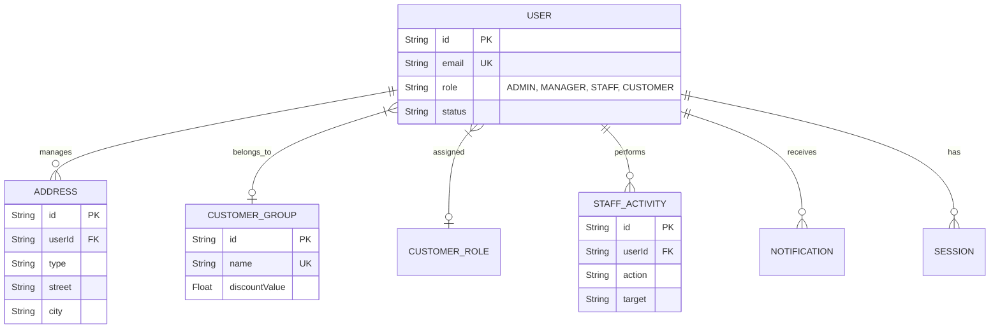
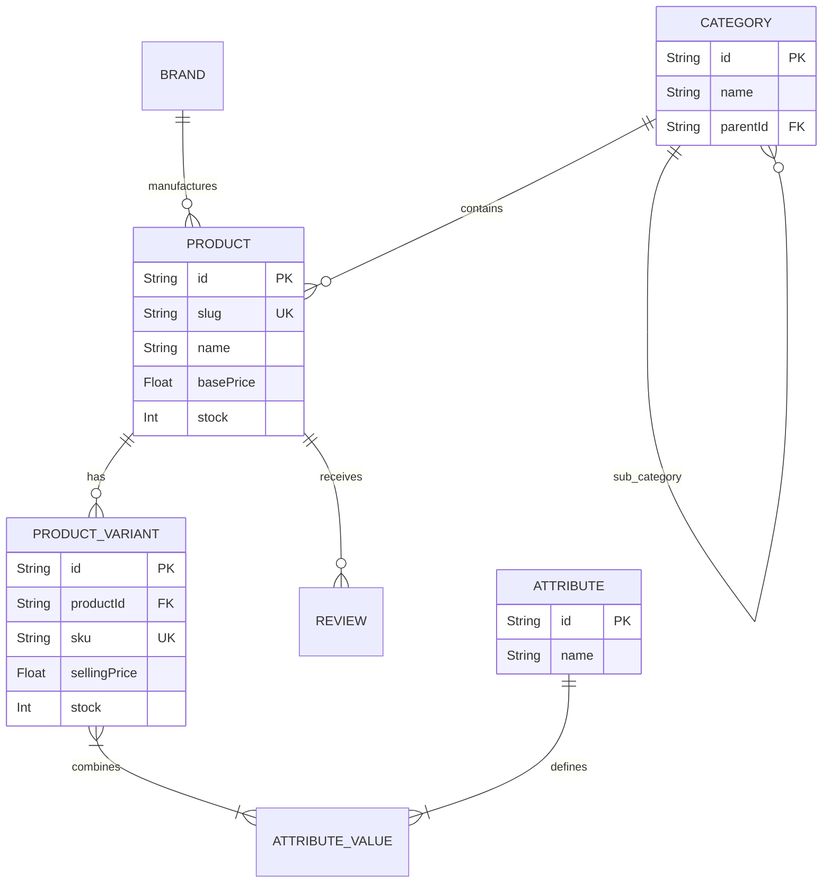
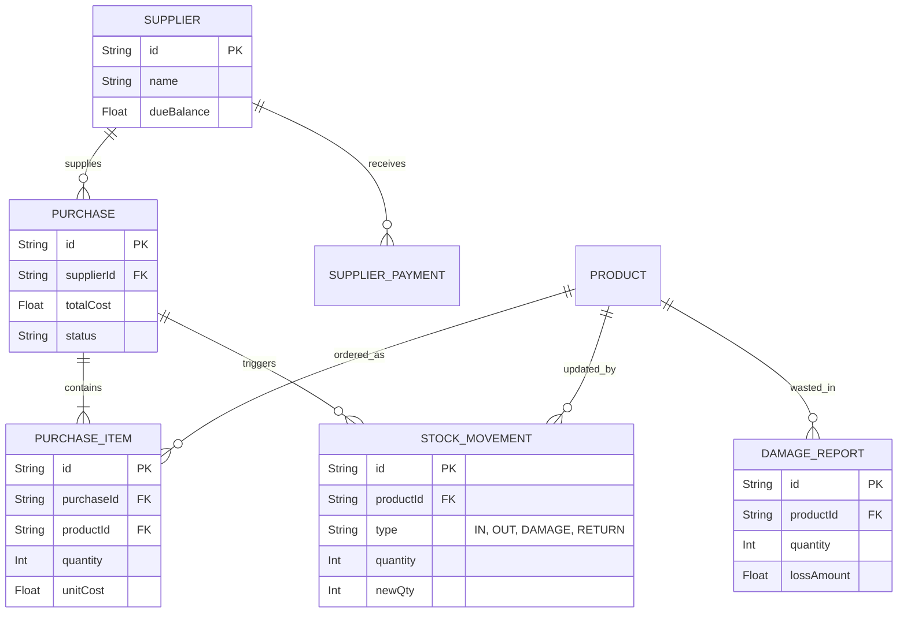
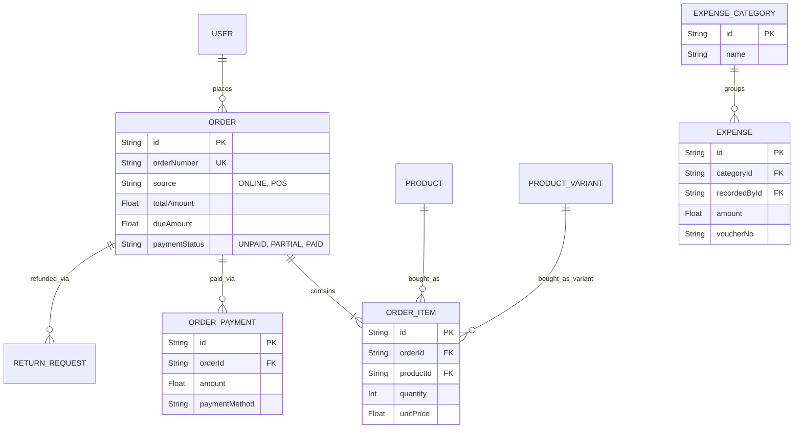
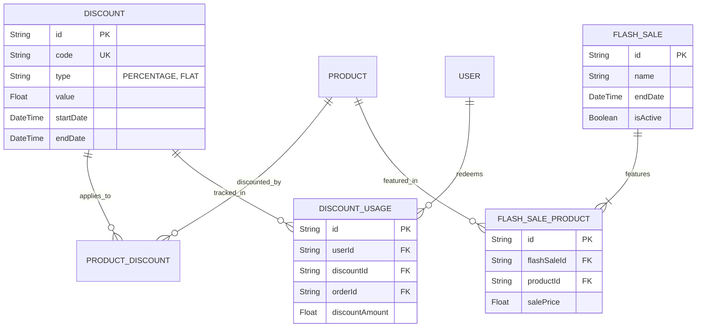

# Mahbub Shop - Entity Relationship Diagrams (ERD)

Because the database schema for Mahbub Shop is large and complex, the Entity Relationship Diagram (ERD) has been broken down into logical modules. These diagrams use standard Crow's Foot notation to represent relationships (`One-to-One`, `One-to-Many`, `Many-to-Many`).

---

## 1. User & Access Control ERD
This diagram outlines how users, staff, and customers are managed along with their roles and groupings.

---

## 2. Product Catalog ERD
This diagram shows how products are categorized, defined by attributes, and broken down into variants.

---

## 3. Inventory & Supply Chain ERD
This illustrates how products enter the system via suppliers and how stock movements are audited.

---

## 4. Sales, Orders & Financials ERD
This diagram tracks the lifecycle of an order, partial due payments, and operational expenses.

---

## 5. Marketing & Promotion ERD
This diagram maps out discounts, coupons, and flash sales applied to products and users.

